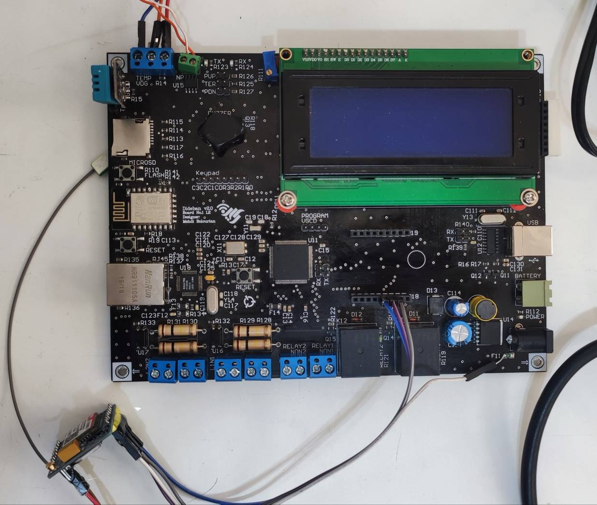
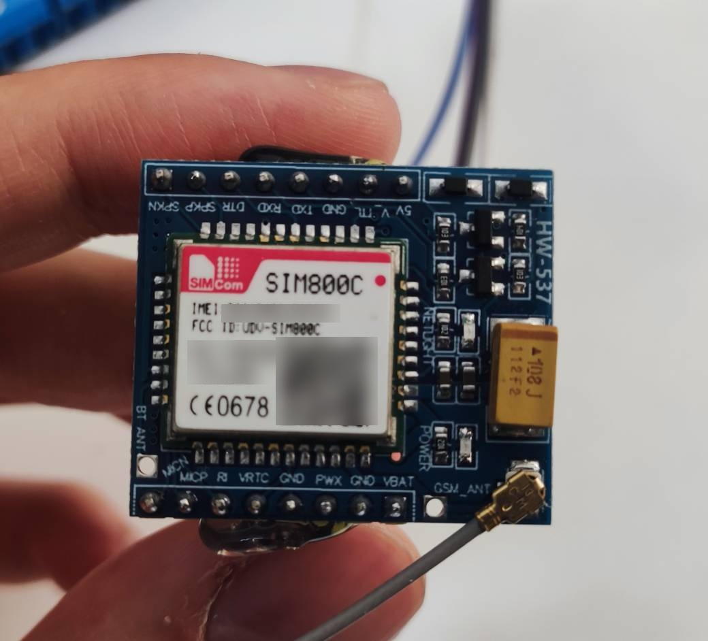
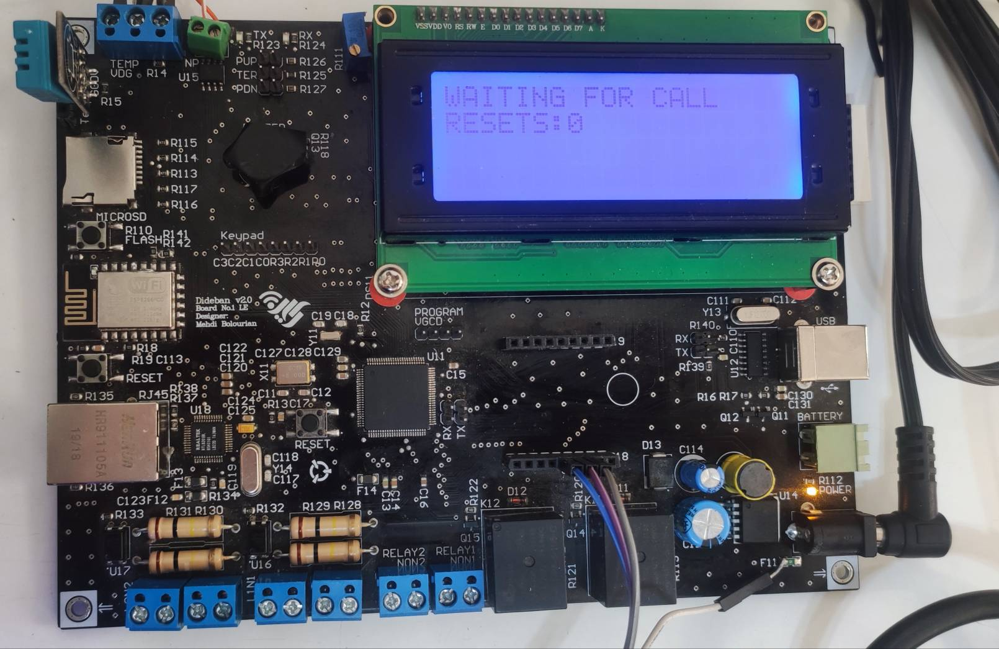

# Cellular DTMF Control

An embedded cellular control system based on an **STM32F407VGT6** microcontroller and a **SIM800C GSM module**.

The system receives incoming cellular voice calls, answers them automatically, detects DTMF keypad tones, and forwards the detected keys to the STM32 through UART. The received key can then be displayed or mapped to application-specific outputs such as LEDs, relays, or control commands.

---

## System Overview

```text
Incoming cellular call
        ↓
SIM800C receives the call
        ↓
STM32 detects RING over UART
        ↓
STM32 sends ATA
        ↓
Call becomes active
        ↓
Caller presses a DTMF key
        ↓
SIM800C reports +DTMF
        ↓
STM32 processes the key
        ↓
LCD / relay / output control
```

Example modem notification:

```text
+DTMF: 5
```

The STM32 can display the received key or map it to a device command.

---

## Current Project Status

The cellular call and DTMF path has been validated successfully on real hardware and the validated implementation is now used as the production firmware on `main`.

Verified functionality:

- HD44780-compatible character LCD in 4-bit mode
- STM32F407 USART3 communication with SIM800C
- SIM-card detection
- GSM network registration
- Signal-strength query
- Incoming-call detection using `RING`
- Automatic call answering using `ATA`
- Active-call verification using `AT+CLCC`
- Received-DTMF reporting using `AT+DDET`
- DTMF key display on the LCD
- Multiple consecutive incoming calls
- Interrupt-driven UART reception
- Asynchronous modem-response capture

The validated firmware successfully handled consecutive incoming calls and displayed DTMF keys during each active call.

The production firmware on `main` now uses this validated call and DTMF sequence.

The following DTMF symbols can be handled by the parser:

```text
0 1 2 3 4 5 6 7 8 9
* #
A B C D
```

Standard mobile-phone keypads normally provide:

```text
0-9
*
#
```

---

## Hardware Prototype

### STM32F407 + SIM800C HW-537



The current prototype uses an STM32F407VGT6 development board connected to a SIM800C-based **HW-537** carrier board.

### SIM800C HW-537 Module



Device-specific identifiers in the public image have been redacted.

### Incoming Call and DTMF Test



The character LCD is used to display call state and received DTMF keys during testing.

---

## Hardware

Current hardware includes:

- STM32F407VGT6 microcontroller
- Dideban v2.0 development board
- SIM800C GSM/GPRS module on an HW-537 carrier board
- HD44780-compatible character LCD
- GSM antenna
- ST-LINK V2 programmer
- External regulated power supply
- Active SIM card with GSM voice-call support
- Separate phone for incoming-call and DTMF testing

---

## UART Connection

The SIM800C communicates with `USART3` of the STM32F407.

| Signal | STM32F407 pin | Direction |
| --- | --- | --- |
| USART3_TX | PD8 | STM32 → SIM800C |
| USART3_RX | PD9 | SIM800C → STM32 |

UART configuration:

```text
Baud rate:            115200
Word length:          8 bits
Parity:               None
Stop bits:            1
Hardware flow control: Disabled
Mode:                 Transmit and Receive
```

Typical modem messages include:

```text
OK
RING
NO CARRIER
+CLCC: ...
+DTMF: 5
```

UART is used for AT commands, modem responses, and unsolicited result codes. Raw voice audio does not pass through USART3.

---

## UART Receive Architecture

Cellular modem messages arrive asynchronously, so the production firmware uses interrupt-driven UART reception and a circular receive buffer.

The architecture is:

```text
USART3 RX interrupt
        ↓
Single received byte
        ↓
UART circular buffer
        ↓
Main-loop parser
        ↓
Complete modem line
        ↓
Command / URC processing
```

This allows unsolicited modem messages such as:

```text
RING
NO CARRIER
+DTMF: 3
```

to be captured while the application continues running.

During debugging, simplified diagnostic firmware was also used to isolate UART and modem behavior independently from the production state machine.

---

## Validated Call Flow

The simplified sequence that was successfully validated on real hardware is:

```text
Disable command echo
        ↓
Enable DTMF reporting
        ↓
Wait for RING
        ↓
Send ATA
        ↓
Wait for call establishment
        ↓
Query AT+CLCC
        ↓
Confirm active call
        ↓
Receive +DTMF notifications
```

For an incoming active voice call, `AT+CLCC` was observed with:

```text
direction = 1
status    = 0
```

After the call becomes active, DTMF notifications are received asynchronously over UART.

---

## DTMF Control

SIM800C DTMF reporting is enabled using:

```text
AT+DDET=1,0,0
```

During an active call, pressing a keypad digit can produce a UART notification such as:

```text
+DTMF: 1
```

or:

```text
+DTMF: #
```

The firmware validates the received symbol and can map it to an application action.

Example future mappings:

```text
1      → Output 1 ON
2      → Output 1 OFF
11#    → Command sequence
21#    → Another application command
```

Multi-digit command sequences can therefore be implemented in the STM32 application layer using standard DTMF symbols.

---

## LCD Connection

The LCD operates in 4-bit mode.

| LCD signal | STM32F407 pin |
| --- | --- |
| RS | PE7 |
| RW | PE8 |
| EN | PE9 |
| D4 | PE10 |
| D5 | PE11 |
| D6 | PE12 |
| D7 | PE13 |

LCD-related firmware files include:

```text
Core/Inc/lcd.h
Core/Src/lcd.c
Core/Src/main.c
```

Example displays used during development include:

```text
WAITING FOR CALL
```

```text
CALL CONNECTED
PRESS A KEY
```

```text
DTMF RECEIVED
KEY: 5
```

---

## Modem Commands Used

The project currently uses or has tested commands including:

```text
AT
ATE0
AT+CPIN?
AT+CSQ
AT+CREG?
AT+DDET=1,0,0
ATA
AT+CLCC
```

These commands are used for:

- Basic modem communication
- SIM-card readiness
- GSM signal strength
- Network registration
- DTMF reporting
- Answering incoming calls
- Monitoring call state

---

## Two-Way Audio

UART communication and voice communication use separate electrical paths.

### Local board to remote caller

```text
Local voice
    ↓
Microphone interface
    ↓
MICP / MICN
    ↓
SIM800C
    ↓
Cellular network
```

### Remote caller to local board

```text
Cellular network
    ↓
SIM800C
    ↓
SPKP / SPKN
    ↓
Audio amplifier / earpiece / speaker
```

The SIM800C audio pins are differential and require an appropriate analog interface.

Two-way audio hardware is outside the current DTMF-control validation path and remains a separate integration task.

---

## Repository Structure

```text
cellular-dtmf-control/
├── docs/
│   ├── en/
│   │   ├── docx/
│   │   └── pdf/
│   ├── fa/
│   │   ├── docx/
│   │   └── pdf/
│   └── images/
│       └── hardware/
│           ├── hardware-overview.png
│           ├── dtmf-call-test.png
│           └── sim800c-hw537-module-redacted.jpg
├── firmware/
│   └── stm32f407-lcd-test/
└── README.md
```

---

## Technical Reports

The repository contains technical studies and hardware documentation produced during development.

Reports are organized under:

```text
docs/
├── en/
│   ├── docx/
│   └── pdf/
└── fa/
    ├── docx/
    └── pdf/
```

Persian (`fa`) and English (`en`) documentation are kept separately where available.

---

## Development Tools

- STM32CubeIDE
- STM32CubeMX
- STM32CubeF4 firmware package
- STM32CubeProgrammer
- ST-LINK V2
- Git
- GitHub

---

## Building the Firmware

1. Clone the repository:

```bash
git clone https://github.com/amirhossein-sadeghi2003/cellular-dtmf-control.git
cd cellular-dtmf-control
```

2. Open the STM32CubeMX project:

```text
firmware/stm32f407-lcd-test/stm32f407-lcd-test.ioc
```

3. Generate or update the STM32 project if required.

4. Open the generated project in STM32CubeIDE.

5. Build the firmware.

6. Connect the STM32F407 board through SWD using ST-LINK.

7. Flash the firmware and run the target.

---

## Validation Notes

A simplified diagnostic firmware was used during hardware debugging to isolate each stage independently.

The following stages were individually verified:

```text
AT communication
SIM readiness
signal strength
network registration
incoming RING
ATA call answering
active-call CLCC
DTMF reception
repeated incoming calls
```

The known-good diagnostic implementation is preserved in the Git branch:

```text
debug/hw537-known-good-dtmf
```

This branch preserves the original known-good diagnostic checkpoint used during hardware debugging.

---

## Production Firmware Status

The core cellular call and DTMF path has been validated successfully on real hardware.

The production firmware on `main` now uses the hardware-validated call flow for:

- Incoming-call detection
- Automatic call answering
- Active-call confirmation
- DTMF reception
- Consecutive incoming calls
- Interrupt-driven UART reception

Further robustness improvements may include:

- Improving AT-command response timing
- Reducing unnecessary command polling
- Improving modem-reset and UART error recovery
- Long-duration stability testing

---

## Future Work

Planned development includes:

- Mapping DTMF keys to physical outputs
- Relay / LED control
- Configurable multi-digit DTMF commands
- Call authorization
- Caller-number validation
- Persistent configuration
- Optional two-way audio hardware
- Graphical display / menu integration

---

## Safety Note

Cellular modules can draw significant current pulses during GSM transmission.

Use a properly regulated supply, adequate local decoupling, short power paths, and a common ground between the STM32 and modem interface.

Do not connect power to undocumented module pins without verifying the exact carrier-board revision and its schematic.

Power should be disconnected before modifying modem wiring or SIM-card hardware.

---

## Author

**Amirhossein Sadeghi**

Computer Engineering student interested in embedded systems, IoT, computer networks, and real-time monitoring.
